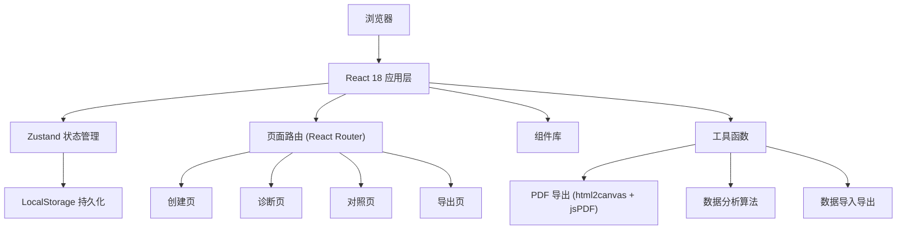
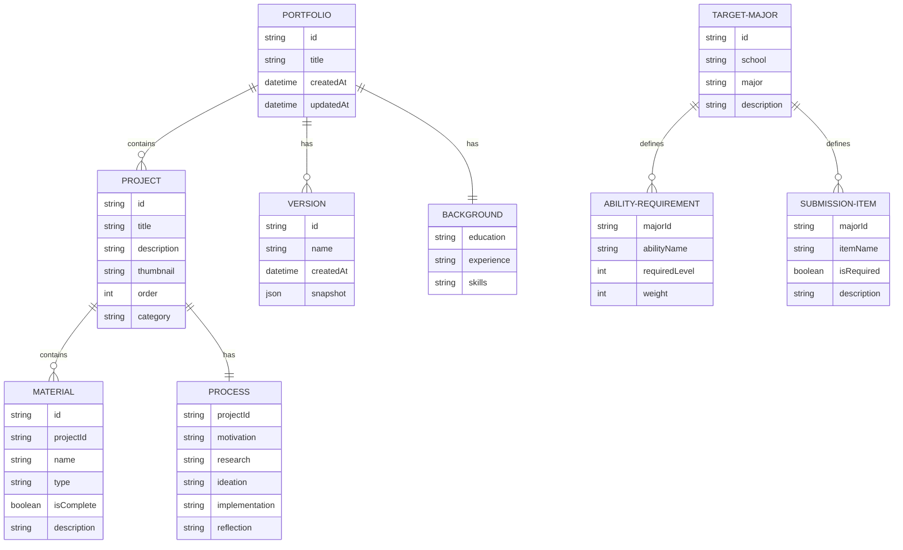

## 1. 架构设计

纯前端单页应用，所有数据本地存储，无需后端服务。



## 2. 技术描述

- **前端框架**：React 18 + TypeScript
- **构建工具**：Vite 5
- **样式方案**：Tailwind CSS 3
- **状态管理**：Zustand 4
- **路由方案**：React Router DOM 6
- **图标库**：Lucide React
- **PDF 导出**：html2canvas + jsPDF
- **拖拽排序**：@dnd-kit/core + @dnd-kit/sortable
- **图表**：Recharts（雷达图等）
- **纯前端、零后端、完全离线可用**

## 3. 路由定义

| Route | 页面 | 功能 |
|-------|------|------|
| `/` | 重定向到 `/create` | 默认入口 |
| `/create` | 创建页 | 项目卡片管理、背景信息填写、过程标注 |
| `/diagnose` | 诊断页 | 目标专业选择、能力缺口分析、素材检查、结构预览 |
| `/compare` | 对照页 | 提交清单、版本对比 |
| `/export` | 导出页 | PDF 导出、数据导入导出 |

## 4. 数据模型

### 4.1 数据模型定义



### 4.2 TypeScript 类型定义

```typescript
interface Project {
  id: string;
  title: string;
  description: string;
  thumbnail?: string;
  order: number;
  category: string;
  process: Process;
  materials: Material[];
  createdAt: string;
  updatedAt: string;
}

interface Process {
  motivation: string;
  research: string;
  ideation: string;
  implementation: string;
  reflection: string;
}

interface Material {
  id: string;
  name: string;
  type: 'image' | 'document' | 'video' | 'other';
  isComplete: boolean;
  description: string;
}

interface Background {
  education: string;
  experience: string;
  skills: string[];
}

interface TargetMajor {
  id: string;
  school: string;
  major: string;
  description: string;
  admissionPreferences: string;
  abilityRequirements: AbilityRequirement[];
  submissionItems: SubmissionItem[];
}

interface AbilityRequirement {
  name: string;
  requiredLevel: number;
  weight: number;
}

interface SubmissionItem {
  id: string;
  name: string;
  isRequired: boolean;
  description: string;
  isCompleted: boolean;
}

interface PortfolioVersion {
  id: string;
  name: string;
  createdAt: string;
  snapshot: PortfolioState;
}

interface PortfolioState {
  projects: Project[];
  background: Background;
  targetMajor?: TargetMajor;
  versions: PortfolioVersion[];
}
```

## 5. 项目目录结构

```
src/
├── components/          # 可复用组件
│   ├── layout/         # 布局组件（导航、页脚等）
│   ├── project/        # 项目相关组件
│   ├── diagnose/       # 诊断相关组件
│   ├── compare/        # 对照相关组件
│   ├── export/         # 导出相关组件
│   └── ui/             # 基础UI组件（卡片、按钮、模态框等）
├── pages/              # 页面组件
│   ├── CreatePage.tsx
│   ├── DiagnosePage.tsx
│   ├── ComparePage.tsx
│   └── ExportPage.tsx
├── store/              # Zustand 状态管理
│   └── usePortfolioStore.ts
├── data/               # 静态数据
│   └── majors.ts       # 目标院校专业数据
├── hooks/              # 自定义 Hooks
│   ├── useDiagnosis.ts
│   ├── usePDFExport.ts
│   └── useLocalStorage.ts
├── utils/              # 工具函数
│   ├── analysis.ts     # 数据分析算法
│   ├── pdf.ts          # PDF 导出工具
│   └── io.ts           # 导入导出工具
├── types/              # TypeScript 类型定义
│   └── index.ts
├── App.tsx
├── main.tsx
└── index.css
```

## 6. 核心算法说明

### 6.1 能力缺口分析算法

```typescript
function calculateAbilityGap(
  projects: Project[],
  requirements: AbilityRequirement[]
): { name: string; currentLevel: number; requiredLevel: number; gap: number }[] {
  // 1. 从项目中提取能力证据
  // 2. 计算每项能力的当前水平（0-5分）
  // 3. 与目标要求对比，计算缺口
  // 4. 按权重排序缺口优先级
}
```

### 6.2 素材完整性检查

```typescript
function checkMaterialCompleteness(project: Project): {
  completeness: number;
  missingItems: Material[];
  suggestions: string[];
} {
  // 1. 检查必备素材是否存在
  // 2. 计算完成百分比
  // 3. 生成补充建议
}
```

### 6.3 叙事连贯性评估

```typescript
function evaluateNarrativeFlow(projects: Project[]): {
  score: number;
  feedback: string[];
} {
  // 1. 检查项目排序逻辑
  // 2. 评估能力成长曲线
  // 3. 验证故事线连贯性
}
```
